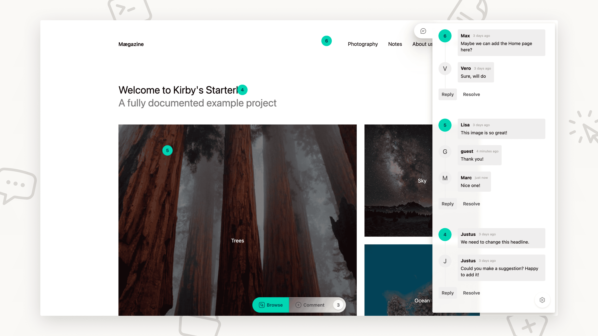

# Kirby Loop

Stay in the loop. A powerful visual feedback plugin for Kirby CMS that allows users to add comments directly on web pages by clicking on elements. Perfect for client reviews, content collaboration, and team feedback workflows.

## Features

- 🎯 **Click-to-comment**: Toggle between navigate mode for normal browsing and comment mode to click anywhere and add feedback
- 🌍 **Multi-language support**: Full support for Kirby's multi-language sites with automatic language detection
- 💬 **Threaded comments**: Reply to comments for contextual discussions
- 🔒 **Authentication**: Choose whether to restrict access to authenticated users only or allow guest commenting
- 🎨 **Theming**: Built-in light/dark themes with full customization support
- ⚙️ **Auto-injection**: Automatically inject into all pages or manually control placement
- 🗄️ **Local storage**: All data stored locally in SQLite - no external dependencies

## How It Works

Kirby Loop transforms your website into a collaborative workspace where teams can provide feedback directly on web pages.

**Visual Context**: Users can click on any element to leave specific comments, creating a direct connection between feedback and content.

**Streamlined Communication**: Team members, clients, and stakeholders can point out issues and suggest improvements right where they see them.

**Organized Discussions**: Comments support threaded replies and can be marked as resolved to maintain a clean feedback pipeline.

**Privacy & Data Control**: All feedback data is stored locally in a SQLite database on your server - no external services or cloud dependencies.

## Quick Start

1. **Install**: `composer require moinframe/kirby-loop`
2. **Use**: Kirby Loop is automatically active on all pages for authenticated users
3. **Configure**: Customize settings in `site/config/config.php` (optional)

## Documentation

Detailed documentation is available in the `docs/` folder:

- **[Installation Guide](https://moinfra.me/docs/moinframe-loop/01-installation)** - Complete installation instructions
- **[Configuration Guide](https://moinfra.me/docs/moinframe-loop/02-configuration)** - All configuration options and advanced settings
- **[Multi-Language Support](https://moinfra.me/docs/moinframe-loop/03-multi-language)** - Setup and customization for multi-language sites
- **[API Reference](https://moinfra.me/docs/moinframe-loop/05-api)** - API documentation
- **[Theming Guide](https://moinfra.me/docs/moinframe-loop/04-theming)** - Theme customization and creating custom themes

## Basic Configuration

Add these options to your `site/config/config.php`:

```php
return [
    // Enable/disable loop (default: true)
    'moinframe.loop.enabled' => true,

    // Or use a callback for conditional enabling
    'moinframe.loop.enabled' => function($page) {
        return in_array($page->template()->name(), ['article', 'blog']);
    },

    // Disable auto-injection (default: true)
    'moinframe.loop.auto-inject' => false,

    // Set header position: 'top' or 'bottom' (default: 'top')
    'moinframe.loop.position' => 'bottom',

    // Make feedback public (default: false - requires auth)
    'moinframe.loop.public' => true,

    // Force UI language (default: null - auto-detect)
    'moinframe.loop.language' => 'de',

    // Set theme: 'default', 'dark', or custom theme name
    'moinframe.loop.theme' => 'dark',
];
```

See the [Configuration Guide](https://moinfra.me/docs/moinframe-loop/02-configuration) for all available options.

## Requirements

- Kirby CMS 4.0+
- PHP 8.3+
- SQLite support

## Important Notes

> [!WARNING]
> Pages with the snippet automatically have Kirby's page **cache** **disabled**. This is necessary for CSRF token validation and User authentication checks.


## Support

- **Documentation**: See the [Documentation](https://moinfra.me/docs/moinframe-loop) for installation and usage instructions
- **Issues**: Report bugs on [GitHub Issues](https://github.com/moinframe/kirby-loop/issues)

## License

MIT License - see [LICENSE.md](LICENSE.md)
